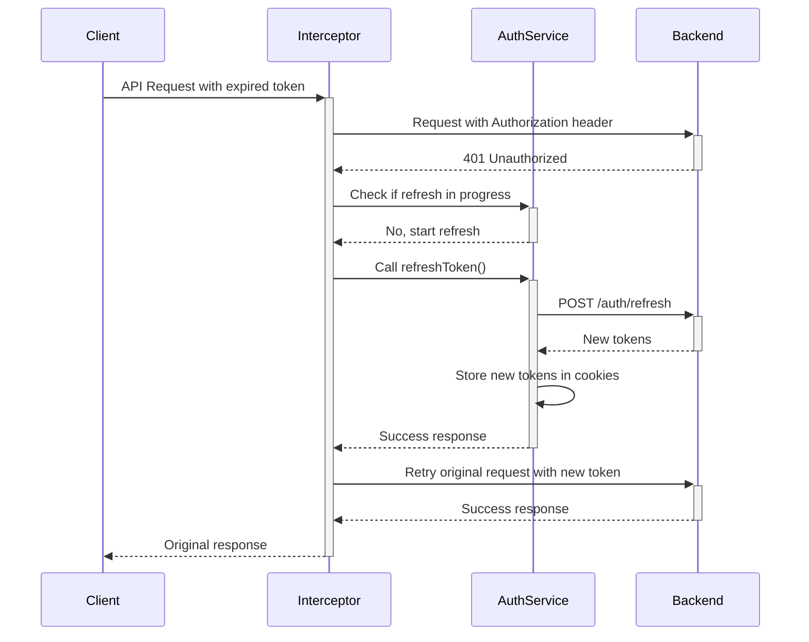

# 🔐 JWT Token Refresh Implementation

## 🎯 **Overview**

This implementation provides automatic JWT token refresh using HTTP Interceptors, following security best practices for token-based authentication.

## 🏗️ **Architecture**

### **Key Components:**

1. **`AuthInterceptor`** - Handles automatic token refresh
2. **`LoadingInterceptor`** - Manages loading states
3. **`AuthService`** - Manages authentication state and token operations
4. **`LoadingService`** - Global loading state management
5. **`LoadingSpinnerComponent`** - Global loading UI

## 🔄 **Token Refresh Flow**



## 🛡️ **Security Features**

### **1. Concurrent Request Handling**
- Uses `BehaviorSubject` to prevent multiple refresh calls
- Queues concurrent requests during token refresh
- Retries all queued requests with new token

### **2. Secure Token Storage**
```typescript
// HTTP-only cookies prevent XSS attacks
Cookies.set('access_token', accessToken, {
  secure: true,           // HTTPS only
  sameSite: 'strict',     // CSRF protection
  expires: 1/24           // 1 hour expiration
});
```

### **3. Automatic Logout on Failure**
- Logs out user if refresh token is invalid
- Clears all stored tokens
- Redirects to login page

### **4. Endpoint Exclusion**
```typescript
private isAuthEndpoint(url: string): boolean {
  const authEndpoints = [
    '/auth/init',
    '/auth/verify', 
    '/auth/refresh',
    '/auth/logout'
  ];
  return authEndpoints.some(endpoint => url.includes(endpoint));
}
```

## 📁 **File Structure**

```
src/app/
├── core/
│   ├── interceptors/
│   │   ├── auth.interceptor.ts          # Token refresh logic
│   │   └── loading.interceptor.ts       # Loading state management
│   ├── services/
│   │   ├── auth.service.ts              # Authentication operations
│   │   └── loading.service.ts           # Global loading state
│   └── guards/
│       └── auth.guard.ts                # Route protection
├── shared/
│   └── components/
│       └── loading-spinner/
│           └── loading-spinner.component.ts  # Global loading UI
└── app.config.ts                       # Interceptor registration
```

## 🔧 **Implementation Details**

### **1. AuthInterceptor Key Methods**

```typescript
// Add Authorization header to requests
private addTokenHeader(request: HttpRequest<any>): HttpRequest<any> {
  const token = this.authService.getAccessToken();
  if (token) {
    return request.clone({
      headers: request.headers.set('Authorization', `Bearer ${token}`)
    });
  }
  return request;
}

// Handle 401 errors with token refresh
private handle401Error(request: HttpRequest<any>, next: HttpHandler) {
  if (!this.isRefreshing) {
    this.isRefreshing = true;
    return this.authService.refreshToken().pipe(
      switchMap(() => next.handle(this.addTokenHeader(request)))
    );
  } else {
    // Wait for ongoing refresh to complete
    return this.refreshTokenSubject.pipe(
      filter(token => token !== null),
      take(1),
      switchMap(() => next.handle(this.addTokenHeader(request)))
    );
  }
}
```

### **2. Enhanced AuthService**

```typescript
refreshToken(): Observable<AuthResponse> {
  const refreshToken = this.getRefreshToken();
  if (!refreshToken) {
    this.logout();
    return throwError(() => new Error('No refresh token available'));
  }

  return this.http.post<AuthResponse>(`${this.API_BASE_URL}/refresh`, {
    refreshToken: refreshToken
  }).pipe(
    map(response => {
      if (response.success && response.data) {
        this.setAuthTokens(response.data.accessToken, response.data.refreshToken);
        if (response.data.user) {
          this.currentUserSubject.next(response.data.user);
        }
        this.isAuthenticatedSubject.next(true);
      } else {
        this.logout();
        throw new Error('Token refresh failed');
      }
      return response;
    }),
    catchError(error => {
      this.logout();
      return this.handleError(error);
    })
  );
}
```

## 🎨 **User Experience Features**

### **1. Global Loading Spinner**
- Shows during API calls (except auth endpoints)
- Prevents UI flicker during token refresh
- Material Design spinner with overlay

### **2. Seamless Authentication**
- Users never see 401 errors
- Automatic retry of failed requests
- No interruption to user workflow

### **3. Error Handling**
- Graceful fallback to login page
- Clear error messages
- Proper cleanup of authentication state

## 🧪 **Testing the Implementation**

### **Scenario 1: Token Expiration**
1. Login with valid credentials
2. Wait for access token to expire (or manually expire it)
3. Make an API call
4. Verify: Request succeeds with new token

### **Scenario 2: Refresh Token Expiration**
1. Login with valid credentials
2. Manually expire refresh token
3. Make an API call after access token expires
4. Verify: User is logged out and redirected to login

### **Scenario 3: Concurrent Requests**
1. Login with valid credentials
2. Make multiple API calls simultaneously after token expires
3. Verify: Only one refresh call is made, all requests succeed

## 🛠️ **Configuration Options**

### **Environment Variables**
```typescript
// src/environments/environment.ts
export const environment = {
  production: false,
  apiBaseUrl: 'http://localhost:8081/api/v1',
  tokenRefreshBuffer: 5 * 60 * 1000, // 5 minutes before expiry
};
```

### **Cookie Settings**
```typescript
const cookieOptions = {
  secure: environment.production,     // HTTPS in production only
  sameSite: 'strict' as const,       // CSRF protection
  expires: 7                         // 7 days for refresh token
};
```

## 🚀 **Benefits**

### **Security**
- ✅ Secure token storage in HTTP-only cookies
- ✅ Automatic token refresh prevents session expiry
- ✅ CSRF protection with SameSite cookies
- ✅ Proper cleanup on authentication failure

### **User Experience**
- ✅ Seamless authentication without user intervention
- ✅ No interruption during token refresh
- ✅ Global loading states for better feedback
- ✅ Graceful error handling

### **Developer Experience**
- ✅ Automatic handling - no manual token management
- ✅ Works with all HTTP calls automatically
- ✅ Easy to test and debug
- ✅ Follows Angular best practices

## 📋 **Integration with Spring Boot**

Your Spring Boot backend should return 401 status codes when access tokens are expired, and the `/auth/refresh` endpoint should:

1. Accept refresh token in request body
2. Validate refresh token
3. Return new access and refresh tokens
4. Include user information in response

Expected response format:
```json
{
  "success": true,
  "data": {
    "accessToken": "new-jwt-token",
    "refreshToken": "new-refresh-token", 
    "user": {
      "id": "user-id",
      "mobileNumber": "1234567890",
      "name": "User Name",
      "email": "user@example.com"
    }
  }
}
```

This implementation provides enterprise-grade JWT token management with excellent security and user experience! 🎉